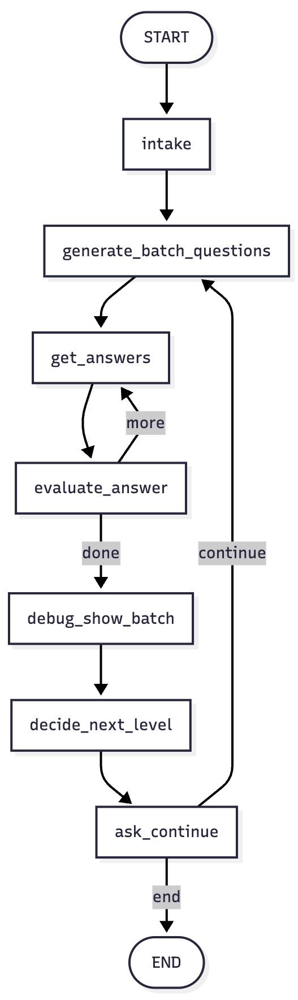

# LangGraph Tutorial with a Project - A LLM Based Teaching Assistant

## Tutorial
Covers topics such as

- Single-agent graph with tools (`add`, `multiply`) and a prebuilt `ToolNode` (agent → tools → agent → END).
- Loop control with integer reducers (`steps/turns`) and a simple stop condition.
- In-graph memory via reducers: `question_count` used in prompts; persisted across calls with `MemorySaver` + `thread_id`.
- Disk persistence using `SqliteSaver` so state survives process restarts.
- Web search (DuckDuckGo) wired via prebuilt `ToolNode`; minimal search→answer flow.
- Custom `ToolNode` that executes a tool and mutates state (e.g., `remember(text)`, call counters).
- Planner → Researcher → Writer pipeline (simplified): planner makes queries, researcher searches, writer summarizes (no citations).
- Guardrails + fallback: check result quality and route to **writer** or **clarify** deterministically.
- Budgets: enforce max search calls and trim final output length (char-cap as token proxy).
- Multi-agent patterns: router to MathAgent (with `add`) vs ChatAgent; Manager → Specialist handoff; per-agent scratchpads.

## Project
- Generates a batch of questions for a chosen **subject** and **level**
- Collects user's answers, **grades** them with an LLM “judge”
- **Adapts difficulty** between batches based on the performance

### Architecture

  

